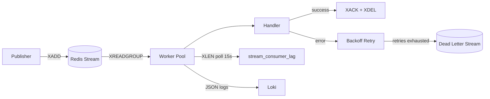
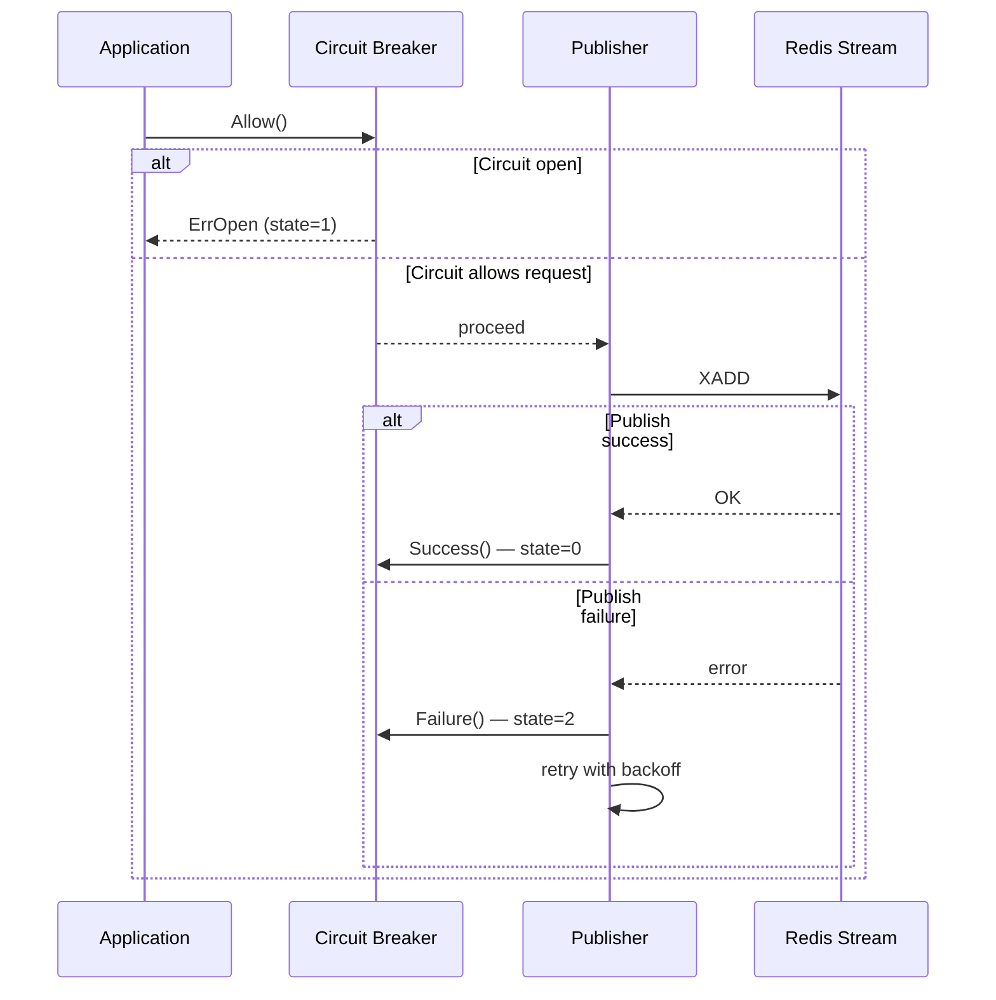
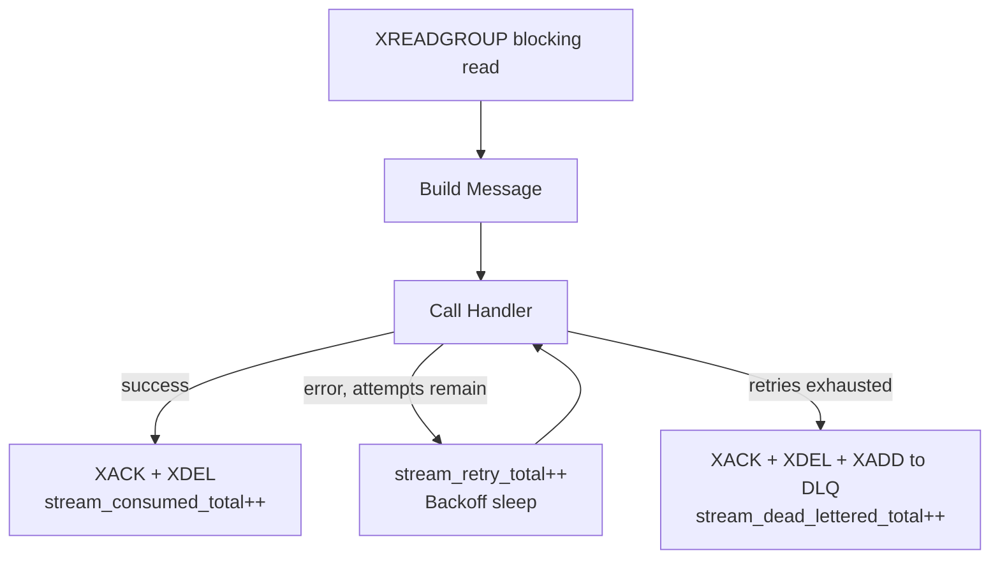
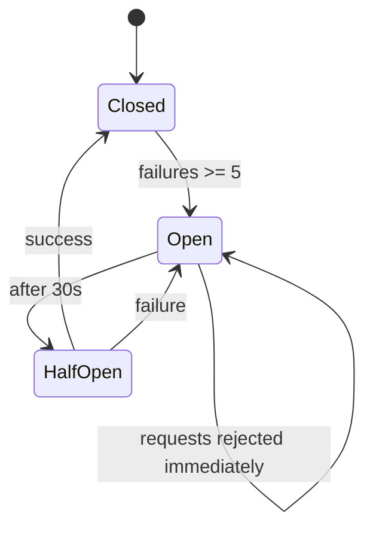

# redis-stream-go

Production-ready Go service for publishing to and consuming from Redis Streams with retries, DLQ, circuit breaker, observability, and Grafana alerting.

## Architecture Overview



The service creates a Redis consumer group, publishes messages with circuit breaker protection, processes messages concurrently, acknowledges successful deliveries, and moves failed messages to a dead-letter stream.

## Features

- Redis Streams producer and consumer group worker
- Concurrent worker pool with configurable goroutine count
- Per-message retry with exponential backoff and jitter
- Dead-letter queue for messages that exhaust retries
- Circuit breaker around publish operations (state exported as metric)
- 11 Prometheus metrics including consumer lag and retry rate
- Two Grafana dashboards in the `Redis Stream` folder with log panels via Loki
- Grafana unified alerting with 7 pre-provisioned alert rules
- Log aggregation via Loki + Promtail (JSON structured logs)
- OpenTelemetry tracing and Zap structured logging
- HTTP health, readiness, and metrics endpoints
- `.env` file support — loaded automatically at startup
- Graceful shutdown with context cancellation

## Getting Started

### Prerequisites

- Go `1.24+`
- Redis `7+`
- Docker (for the full observability stack or integration tests)

### Clone

```bash
git clone <repository-url>
cd redis-stream-go
```

### Run standalone

```bash
cp .env.example .env
# edit .env as needed
go run ./cmd/main.go
```

### Run full stack

```bash
docker compose up -d
```

| Service | URL | Credentials |
|---|---|---|
| App metrics | http://localhost:8080/metrics | — |
| Prometheus | http://localhost:9090 | — |
| Loki | http://localhost:3100 | — |
| Grafana | http://localhost:3000 | `admin` / `admin` |

### Load test

```bash
go run ./cmd/loadtest/main.go
```

Runs 8 sequential scenarios (warm-up → high throughput → error spike → DLQ flood → consumer lag → high latency → recovery → drain) to exercise every panel and trigger every alert.

## Configuration

On startup the service loads `.env` from the working directory (if present), then reads environment variables. Existing OS env vars always take precedence. Duration values use Go duration syntax (`100ms`, `2s`, `30s`).

```bash
cp .env.example .env
```

| Env Var | Default | Description |
|---|---|---|
| `REDIS_ADDR` | `localhost:6379` | Redis server address |
| `REDIS_PASSWORD` | empty | Redis password |
| `REDIS_DB` | `0` | Redis logical database |
| `REDIS_DIAL_TIMEOUT` | `5s` | Redis dial timeout |
| `REDIS_READ_TIMEOUT` | `3s` | Redis read timeout |
| `REDIS_WRITE_TIMEOUT` | `3s` | Redis write timeout |
| `REDIS_MAX_RETRIES` | `3` | Redis client retry attempts |
| `REDIS_POOL_SIZE` | `10` | Redis connection pool size |
| `REDIS_MIN_IDLE_CONNS` | `2` | Minimum idle Redis connections |
| `STREAM_NAME` | `events` | Primary Redis stream |
| `STREAM_CONSUMER_GROUP` | `workers` | Consumer group name |
| `STREAM_CONSUMER_NAME` | `worker` | Consumer name prefix used by workers |
| `STREAM_MAX_LEN` | `10000` | Approximate stream max length for published messages |
| `STREAM_READ_COUNT` | `10` | Messages requested per `XREADGROUP` call |
| `STREAM_BLOCK_TIMEOUT` | `2s` | Blocking read timeout for `XREADGROUP` |
| `STREAM_DEAD_LETTER` | `events.dlq` | Dead-letter stream name |
| `WORKER_CONCURRENCY` | `4` | Number of worker goroutines |
| `WORKER_RETRY_ATTEMPTS` | `3` | Message processing attempts before DLQ |
| `WORKER_RETRY_BASE_DELAY` | `100ms` | Initial retry delay |
| `WORKER_RETRY_MAX_DELAY` | `10s` | Maximum retry delay |
| `WORKER_SHUTDOWN_TIMEOUT` | `30s` | Maximum wait time for workers during shutdown |
| `HTTP_ADDR` | `:8080` | HTTP server bind address |
| `LOG_LEVEL` | `info` | Log level (`debug`, `info`, `warn`, `error`) |
| `LOG_JSON` | `true` | JSON log format when `true` |
| `GF_ALERT_WEBHOOK_URL` | `http://alert-webhook.invalid/alerts` | Grafana alert webhook destination |

## How It Works

### Publisher Flow

The publisher writes to Redis with `XADD`, guarded by a circuit breaker. On failure it retries up to 3 times using exponential backoff with multiplier `2.0` and jitter factor `0.3`. The circuit breaker state is exported as `stream_circuit_breaker_state` (0=closed, 1=open, 2=half-open).

Backoff formula: `delay = BaseDelay × Multiplier^attempt` capped at `MaxDelay`, ±30% jitter.



### Worker Flow

Workers consume messages with `XREADGROUP`, process them concurrently, increment `stream_retry_total` on each retry, and either acknowledge or dead-letter the message.



A background goroutine polls `XLEN` every 15 seconds and publishes the result as `stream_consumer_lag`.

## Circuit Breaker

The publisher uses a three-state circuit breaker with these defaults:

- `MaxFailures = 5`
- `ResetTimeout = 30s`
- `HalfOpenMax = 1`



## Observability

### Metrics

The service exports 11 Prometheus metrics:

| Metric | Type | Description |
|---|---|---|
| `stream_published_total` | Counter | Total messages published |
| `stream_publish_errors_total` | Counter | Total publish errors |
| `stream_publish_duration_seconds` | Histogram | Publish operation latency |
| `stream_consumed_total` | Counter | Total messages successfully processed |
| `stream_consume_errors_total` | Counter | Total handler errors |
| `stream_dead_lettered_total` | Counter | Total messages moved to the DLQ |
| `stream_processing_duration_seconds` | Histogram | Message processing latency |
| `stream_active_workers` | Gauge | Active worker goroutines |
| `stream_consumer_lag` | Gauge | Approximate pending messages in the stream |
| `stream_retry_total` | Counter | Total message processing retry attempts |
| `stream_circuit_breaker_state` | Gauge | Circuit breaker state: 0=closed 1=open 2=half-open |

### Health Endpoints

| Endpoint | Method | Behavior |
|---|---|---|
| `/health` | `GET` | Returns `200` with `{"status":"ok"}` |
| `/ready` | `GET` | Pings Redis — `200 {"status":"ready"}` or `503` if unavailable |
| `/metrics` | `GET` | Prometheus scrape endpoint |

### Grafana Dashboards

Both dashboards live in the `Redis Stream` folder and link to each other.

**Redis Stream Go — Overview** (`redis-stream.json`)

Panels in priority order:

| Row | Panels |
|---|---|
| Service SLOs | Success Rate %, Error Rate %, DLQ Rate %, Consumer Lag, P99 Latency, Circuit Breaker |
| Throughput | Published vs Consumed/s, Consumer Lag trend, Retry Rate |
| Latency | p50 / p95 / p99 / p99.9 for processing and publish |
| Errors & Reliability | Error rate breakdown, DLQ rate, Circuit Breaker over time |
| Worker Saturation | Active workers, cumulative counters |
| Redis Infrastructure | Memory, clients, commands/s, keyspace hit rate, network I/O |
| Logs | All app container logs via Loki |

**Redis Stream Go — Errors** (`redis-stream-errors.json`)

Drill-down dashboard for debugging:

| Row | Panels |
|---|---|
| Error Summary | Consume Error %, Publish Error %, DLQ Rate, Retry Rate |
| Error Rate Over Time | Consume, publish, dead-letter, retry rates — distinct colors |
| Error Breakdown | Accumulated totals, error-to-success ratio, retry exhaustion |
| Latency During Errors | Processing and publish percentiles |
| Circuit Breaker | State over time, current state, active workers |
| Consumer Lag | Lag trend and current value |
| Logs | Error & warning logs filtered by `level=~"error\|warn"` |
| Logs | Worker retry events (`handler error`) and DLQ events (`dead letter`) |

### Grafana Alerting

7 alert rules are provisioned automatically via `deploy/grafana/provisioning/alerting/alerts.yaml`:

| Alert | Severity | Condition | For |
|---|---|---|---|
| App Down | critical | `up{job="redis-stream-go"} < 1` | 1m |
| Redis Down | critical | `redis_up < 1` | 1m |
| Circuit Breaker Open | critical | `stream_circuit_breaker_state > 0` | 30s |
| High Consume Error Rate | warning | error rate > 5% | 2m |
| DLQ Spike | warning | `rate(stream_dead_lettered_total[5m]) > 0` | 1m |
| Consumer Lag High | warning | `stream_consumer_lag > 1000` | 2m |
| P99 Latency High | warning | p99 processing latency > 1s | 3m |

Set `GF_ALERT_WEBHOOK_URL` in `.env` to route notifications to Slack, PagerDuty, or any webhook receiver.

### Logs

Container logs are collected by Promtail, shipped to Loki, and surfaced in the Grafana dashboards. The app emits structured JSON logs via Zap, parsed by Promtail with fields `level`, `logger`, and `msg` as labels.

- Overview dashboard shows all app logs
- Errors dashboard filters to `level=error|warn` and DLQ/retry events

### Tracing

OpenTelemetry with the stdout exporter (service name: `redis-stream-go`).

## Testing

### Unit tests

```bash
go test ./tests/unit/... -v
```

Uses `miniredis` — no Docker required.

### Integration tests

```bash
go test -tags integration ./tests/integration/... -v
```

Uses `testcontainers-go` — Docker required.

### Load test

```bash
# requires docker compose up -d to be running
go run ./cmd/loadtest/main.go
```

| Scenario | Rate | Behavior |
|---|---|---|
| warm-up | 10/s | Baseline — verify throughput panels |
| high-throughput | 100/s | Spike — watch worker saturation |
| error-spike | 20/s + 50% errors | Triggers High Consume Error Rate alert |
| dlq-flood | 10/s + 100% fail | Triggers DLQ Spike alert |
| consumer-lag | 60/s + 150ms delay | Consumer lag grows past 1000 |
| high-latency | 5/s + 2s delay | Triggers P99 Latency High alert |
| recovery | 10/s | Metrics recover, alerts resolve |
| drain | 0/s | Consumer lag drains to zero |

## Project Structure

```text
redis-stream-go/
├── cmd/
│   ├── main.go                                        # Entry point — loads .env, wires components
│   └── loadtest/main.go                               # Load test — 8 scenarios, exercises all panels
├── internal/
│   ├── config/
│   │   ├── config.go                                  # Env-based configuration
│   │   └── dotenv.go                                  # .env file loader
│   ├── health/server.go                               # HTTP health/metrics server
│   ├── logger/logger.go                               # Zap structured logging
│   ├── observability/
│   │   ├── metrics.go                                 # 11 Prometheus metrics
│   │   └── tracer.go                                  # OpenTelemetry tracer
│   └── stream/
│       ├── client.go                                  # Redis client factory
│       ├── message.go                                 # Message struct + Handler type
│       ├── publisher.go                               # Publisher with circuit breaker
│       └── worker.go                                  # Consumer with retry, DLQ, lag poller
├── pkg/
│   ├── backoff/backoff.go                             # Exponential backoff with jitter
│   └── circuitbreaker/breaker.go                      # Circuit breaker (Closed/Open/Half-Open)
├── deploy/
│   ├── prometheus/prometheus.yml                      # Prometheus scrape config
│   ├── promtail/promtail.yml                          # Log collection from Docker containers
│   └── grafana/
│       ├── dashboards/
│       │   ├── redis-stream.json                      # Overview dashboard (folder: Redis Stream)
│       │   └── redis-stream-errors.json               # Error drill-down dashboard
│       └── provisioning/
│           ├── datasources/
│           │   ├── prometheus.yml                     # Prometheus datasource
│           │   └── loki.yml                           # Loki datasource
│           ├── dashboards/dashboard.yml               # Dashboard provider (folder: Redis Stream)
│           └── alerting/
│               ├── alerts.yaml                        # 7 alert rules
│               ├── contact-points.yaml                # Webhook contact point
│               └── notification-policies.yaml         # Routing policy
├── tests/
│   ├── integration/stream_test.go
│   └── unit/
│       ├── backoff_test.go
│       ├── circuitbreaker_test.go
│       ├── publisher_test.go
│       └── worker_test.go
├── .env.example                                       # All env vars with defaults
└── docker-compose.yml                                 # Full stack: app, Redis, Prometheus, Loki, Promtail, Grafana
```
