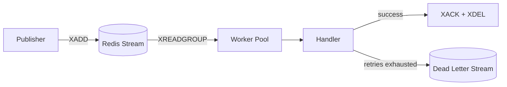
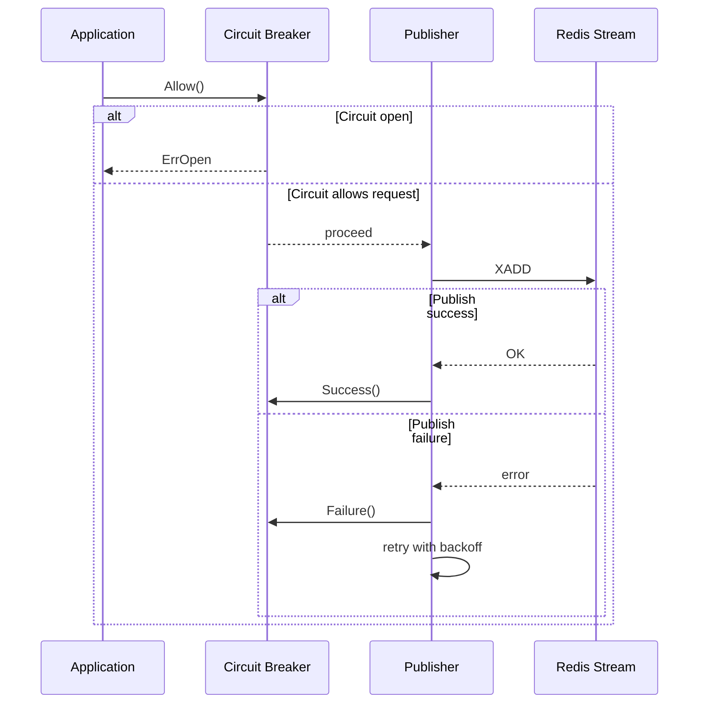
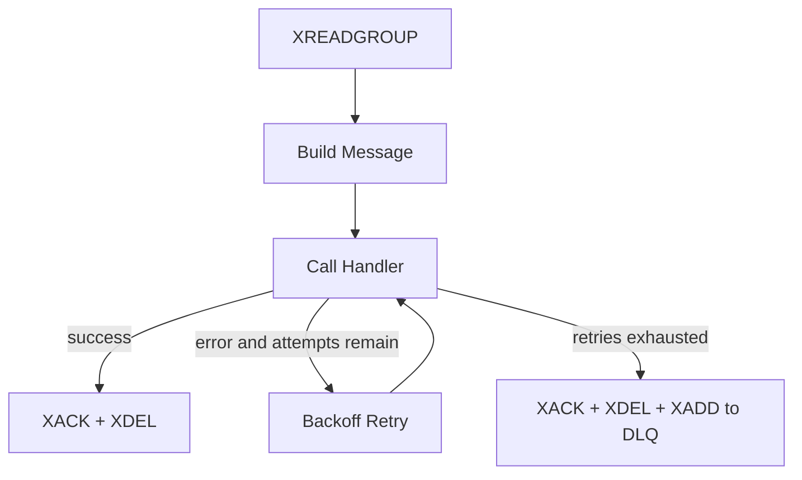
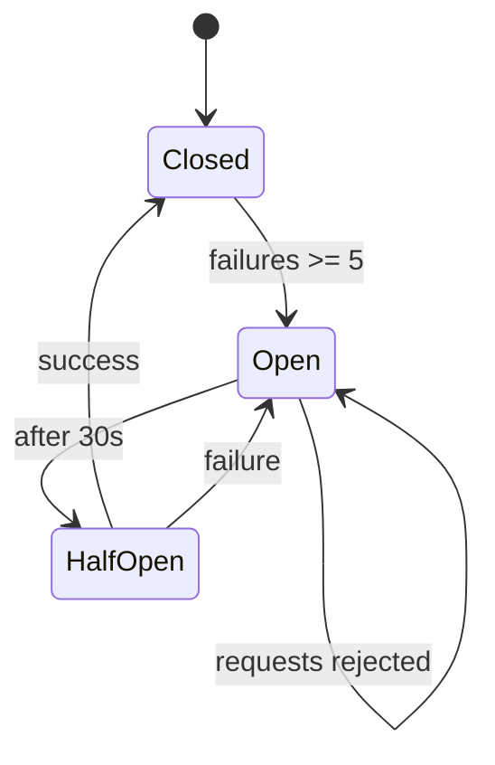

# redis-stream-go

Production-ready Go service for publishing to and consuming from Redis Streams with retries, DLQ, metrics, tracing, and graceful shutdown.

## Architecture Overview



The service creates a Redis consumer group, publishes messages with circuit breaker protection, processes messages concurrently, acknowledges successful deliveries, and moves failed messages to a dead-letter stream.

## Features

- Redis Streams producer and consumer group worker
- Concurrent worker pool with configurable goroutine count
- Per-message retry with exponential backoff and jitter
- Dead-letter queue for messages that exhaust retries
- Circuit breaker around publish operations
- Prometheus metrics and OpenTelemetry tracing
- Zap structured logging
- HTTP health, readiness, and metrics endpoints
- Graceful shutdown with context cancellation

## Getting Started

### Prerequisites

- Go `1.26.1` or later
- Redis `7+`
- Docker, only if you want to run integration tests

### Clone

```bash
git clone <repository-url>
cd redis-stream-go
```

### Run Redis

```bash
docker run --rm -p 6379:6379 redis:7-alpine
```

### Run the service

```bash
go run ./cmd/main.go
```

The service starts the worker pool and exposes:

- `GET /health`
- `GET /ready`
- `GET /metrics`

## Configuration

All configuration is environment-based. Duration values use Go duration syntax such as `100ms`, `2s`, or `30s`.

| Env Var | Default | Description |
|---|---|---|
| `REDIS_ADDR` | `localhost:6379` | Redis server address |
| `REDIS_PASSWORD` | empty | Redis password |
| `REDIS_DB` | `0` | Redis logical database |
| `REDIS_DIAL_TIMEOUT` | `5s` | Redis dial timeout |
| `REDIS_READ_TIMEOUT` | `3s` | Redis read timeout |
| `REDIS_WRITE_TIMEOUT` | `3s` | Redis write timeout |
| `REDIS_MAX_RETRIES` | `3` | Redis client retry attempts |
| `REDIS_POOL_SIZE` | `10` | Redis connection pool size |
| `REDIS_MIN_IDLE_CONNS` | `2` | Minimum idle Redis connections |
| `STREAM_NAME` | `events` | Primary Redis stream |
| `STREAM_CONSUMER_GROUP` | `workers` | Consumer group name |
| `STREAM_CONSUMER_NAME` | `worker` | Consumer name prefix used by workers |
| `STREAM_MAX_LEN` | `10000` | Approximate stream max length for published messages |
| `STREAM_READ_COUNT` | `10` | Messages requested per `XREADGROUP` call |
| `STREAM_BLOCK_TIMEOUT` | `2s` | Blocking read timeout for `XREADGROUP` |
| `STREAM_DEAD_LETTER` | `events.dlq` | Dead-letter stream name |
| `WORKER_CONCURRENCY` | `4` | Number of worker goroutines |
| `WORKER_RETRY_ATTEMPTS` | `3` | Message processing attempts before DLQ |
| `WORKER_RETRY_BASE_DELAY` | `100ms` | Initial retry delay |
| `WORKER_RETRY_MAX_DELAY` | `10s` | Maximum retry delay |
| `WORKER_SHUTDOWN_TIMEOUT` | `30s` | Maximum wait time for workers during shutdown |
| `HTTP_ADDR` | `:8080` | HTTP server bind address |
| `LOG_LEVEL` | `info` | Log level |
| `LOG_JSON` | `true` | Use JSON logs when `true` |

## How It Works

### Publisher Flow

The publisher writes to Redis with `XADD`, guarded by a circuit breaker. On failure, it retries up to 3 times using exponential backoff with multiplier `2.0` and jitter factor `0.3`.

Backoff formula:

`delay = BaseDelay * Multiplier^attempt`, capped at `MaxDelay`, with jitter applied before sleeping.



### Worker Flow

Workers consume messages with `XREADGROUP`, process them concurrently, retry failures with backoff, and either acknowledge or dead-letter the message.



Worker behavior:

- Starts `N` goroutines, where `N = WORKER_CONCURRENCY`
- Uses Redis consumer groups for coordinated delivery
- Records processing metrics for success and failure paths
- Stops cleanly when the worker context is canceled

## Circuit Breaker

The publisher uses a three-state circuit breaker with these defaults:

- `MaxFailures = 5`
- `ResetTimeout = 30s`
- `HalfOpenMax = 1`



## Observability

### Metrics

The service exports 8 Prometheus metrics:

| Metric | Type | Description |
|---|---|---|
| `stream_published_total` | Counter | Total published messages |
| `stream_publish_errors_total` | Counter | Total publish errors |
| `stream_publish_duration_seconds` | Histogram | Publish latency |
| `stream_consumed_total` | Counter | Total successfully processed messages |
| `stream_consume_errors_total` | Counter | Total handler errors |
| `stream_dead_lettered_total` | Counter | Total messages moved to the DLQ |
| `stream_processing_duration_seconds` | Histogram | Message processing latency |
| `stream_active_workers` | Gauge | Active worker goroutines |

### Health Endpoints

| Endpoint | Method | Behavior |
|---|---|---|
| `/health` | `GET` | Returns `200` with `{"status":"ok"}` |
| `/ready` | `GET` | Pings Redis and returns `200` with `{"status":"ready"}` or `503` if Redis is unavailable |
| `/metrics` | `GET` | Prometheus scrape endpoint |

### Logging and Tracing

- Logging uses Zap and defaults to JSON output
- Tracing uses OpenTelemetry with the stdout trace exporter
- The service name is `redis-stream-go`

## Testing

### Unit tests

Unit tests use `miniredis` and do not require Docker.

```bash
go test ./tests/unit/... -v
```

### Integration tests

Integration tests use `testcontainers-go` and require Docker.

```bash
go test -tags integration ./tests/integration/... -v
```

## Project Structure

```text
redis-stream-go/
├── cmd/main.go                          # Application entry point
├── internal/
│   ├── config/config.go                 # Env-based configuration
│   ├── health/server.go                 # HTTP health/metrics server
│   ├── logger/logger.go                 # Zap structured logging
│   ├── observability/
│   │   ├── metrics.go                   # Prometheus metrics
│   │   └── tracer.go                    # OpenTelemetry tracer
│   └── stream/
│       ├── client.go                    # Redis client factory
│       ├── message.go                   # Message struct + Handler type
│       ├── publisher.go                 # Redis stream publisher
│       └── worker.go                    # Redis stream consumer
├── pkg/
│   ├── backoff/backoff.go               # Exponential backoff with jitter
│   └── circuitbreaker/breaker.go        # Circuit breaker pattern
└── tests/
    ├── integration/stream_test.go
    └── unit/
        ├── backoff_test.go
        ├── circuitbreaker_test.go
        ├── publisher_test.go
        └── worker_test.go
```
